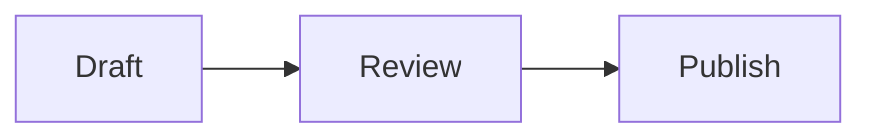

# Markdown content components

Public articles and the admin text-edit preview recognize the following fenced code blocks.
Keep the language labels lowercase. The admin editor preserves the fenced source when it
converts the rendered preview back to Markdown.

## Mermaid diagrams

Use a `mermaid` fence with ordinary Mermaid source. The browser renders it in Mermaid strict
security mode; if parsing fails, readers see the source as a normal code block.

````markdown

````

## Installation guides

Use an `installer` fence containing JSON. `title`, at least one package-manager command, and
at least one step are required. `intro` is optional. Manager keys are limited to `npm`, `pnpm`,
`yarn`, and `bun`. Each step requires `title` and may include `description`, `code`, `language`,
`note`, and `tip`. Unknown fields, malformed JSON, empty commands, or an empty step list leave
the fence as a normal code block. Command and step-code strings are kept literally, including
intentional leading spaces, trailing spaces, and line breaks; each is displayed in a copyable
code block.

````markdown
```installer
{
  "title": "Raven SDK 설치",
  "intro": "프로젝트에서 사용하는 패키지 매니저를 선택하세요.",
  "managers": {
    "npm": "npm install @raven/sdk",
    "pnpm": "pnpm add @raven/sdk",
    "yarn": "yarn add @raven/sdk",
    "bun": "bun add @raven/sdk"
  },
  "steps": [
    {
      "title": "환경 변수 추가",
      "description": "프로젝트 루트의 .env 파일에 토큰을 추가합니다.",
      "code": "RAVEN_TOKEN=your-token",
      "language": "dotenv",
      "note": "토큰은 저장소에 커밋하지 마세요."
    },
    {
      "title": "클라이언트 초기화",
      "code": "import { Raven } from '@raven/sdk';\n\nconst raven = new Raven();",
      "language": "ts",
      "tip": "애플리케이션 시작 시 한 번만 초기화하세요."
    }
  ]
}
```
````
