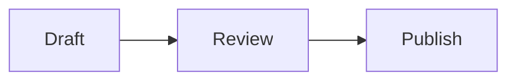

# Markdown 문서 컴포넌트

글 본문과 관리자 미리보기는 아래 fenced code block을 문서 컴포넌트로 렌더링한다. fence가 비어 있거나 형식 검증에 실패하면 일반 코드블럭으로 표시되므로 원문은 사라지지 않는다.

## Mermaid

언어 라벨을 `mermaid`로 지정하고 Mermaid 문법을 그대로 적는다.

````markdown

````

브라우저에서 다이어그램 변환에 실패하면 원문 코드블럭을 대신 표시한다. Mermaid 원문은 HTML로 실행하지 않는다.

## 설치 안내

언어 라벨이 `installer`인 fence 안에 JSON 객체를 적는다.

````markdown
```installer
{
  "title": "Raven SDK 설치",
  "intro": "사용 중인 패키지 매니저를 선택하세요.",
  "managers": {
    "pnpm": "pnpm add @raven/sdk",
    "npm": "npm install @raven/sdk",
    "yarn": "yarn add @raven/sdk",
    "bun": "bun add @raven/sdk"
  },
  "steps": [
    {
      "title": "환경 변수 추가",
      "description": "서버 환경에 API 키를 등록합니다.",
      "language": "bash",
      "code": "export RAVEN_API_KEY=your-key",
      "note": "키를 저장소에 커밋하지 마세요."
    },
    {
      "title": "클라이언트 생성",
      "language": "ts",
      "code": "const raven = createClient()",
      "tip": "클라이언트는 한 번만 생성해 재사용하세요."
    }
  ]
}
```
````

- `title`: 필수 문자열
- `intro`: 선택 문자열
- `managers`: 필수 객체. `npm`, `pnpm`, `yarn`, `bun` 중 하나 이상의 명령 문자열이 필요하다. JSON에 먼저 적은 유효한 항목이 기본 탭이 된다.
- `steps`: 하나 이상의 객체가 필요한 배열
- 각 단계의 `title`: 필수 문자열
- 각 단계의 `description`, `language`, `code`, `note`, `tip`: 선택 문자열

패키지 매니저 명령과 단계의 `code` 값은 앞뒤 공백과 들여쓰기를 포함해 그대로 코드블럭에 표시된다. 공백만 있는 값은 유효한 명령이나 코드로 보지 않는다.

알 수 없는 필드, 허용하지 않은 패키지 매니저, 잘못된 JSON은 설치 안내로 변환하지 않는다. 관리자 텍스트 편집에서 다른 내용을 수정해도 두 컴포넌트는 각 fence 원문으로 돌아간다.
